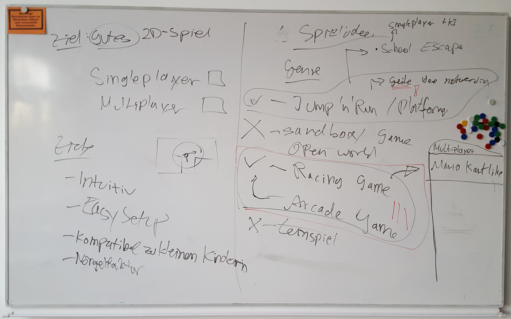
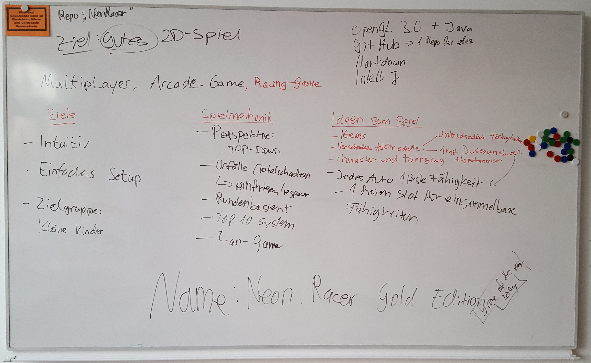

# Entwicklungstagebuch

## 07.02.2019
Heute beginnen wir mit den Planungen für unser Projekt. Zunächst schreiben wir für unser Brainstorming zwei Tafeln voll:

Nach Unterrichtsende richtet Tim schon das Repository auf GitHub ein und Daniel erstellt eine Gruppe auf Wire.

## 14.02.2019
Der Informatikunterricht entfällt heute. Da wir mit unserem Projekt aber trotzdem voran kommen wollen, machen wir einen Conference Call über Wire. Abgesehen von Maxim sind alle dabei. Für das weitere Vorgehen besprechen wir die nächsten Schritte jedes einzelnen.

Tim
- OpenGL Projekt anlegen
- Grundlegende Redering-Pipeline implementieren

Daniel
- Anforderungen an die Dokumentation mit der Auftraggeberin besprechen
- Konzept im Spannungsfeld des magischen Dreiecks aufschreiben
- Projektumfeldanalyse durchführen und dokumentieren

Johannes
- Entwürfe für Automodelle zeichnen
- Besondere Fähigkeiten verschiedener Autos aufschreiben

Jonas
- Texturen für Rennstrecke und Autos erstellen
- Neon/Cartoon Designstil ggfs. anpassen

## 21.02.2019

Heute besprechen wir, welche Aufgaben wir in welcher Reihenfolge machen müssen. Im Kapitel _Nächste Aufgaben_ wird die Liste stets aktualisiert.

## 04.04.2019

Nach langer Abiturpause treffen wir uns wieder als komplettes Team. Das wichtigste Thema ist die Physik-Implementation und das Timer-System. Wir entscheiden uns für ein System, das Ticks in regelmäßigen Abständen unabhängig von der Grafik ausführt. Mit einer Delta-Zeit können Bewegungen bei hohen Framerates interpoliert werden.

## 10.04.2019

Tim übernimmt für Maxim die Implementation der Physik-Engine. Die Aufgaben und die jeweiligen Verantwortlichen verschieben wir in [GitHub Issues](https://github.com/Twometer/NeonRacer/issues).

## 11.04.2019

Wir besprechen wichtige Grundlagen des Spielablaufs:
1. Spielstart
2. Server auswählen
3. Mit Nickname anmelden
4. Spiel starten oder Spiel beitreten
5. Abstimmung für Rennstrecke
6. Auto auswählen
7. Rennen fahren

Für die Serverauswahl kann evtl. ein UDP Multicast verwendet werden. Auf jedem Server läuft immer nur ein Rennen parallel. Sobald ein Spieler im Hauptmenü ein Rennen startet, werden alle anderen verbundenen Spieler angefragt und haben 10 Sekunden Zeit, dem Rennen beizutreten. Dann startet die Auswahl für Auto und Rennstrecke. Wählt der Nutzer innerhalb der Frist nichts aus, werden Rennstrecke und Autos vom Server zugeteilt. Spieler die nicht oder erst verspätet beigetreten sind, können den aktuellen Zustand beobachten.
